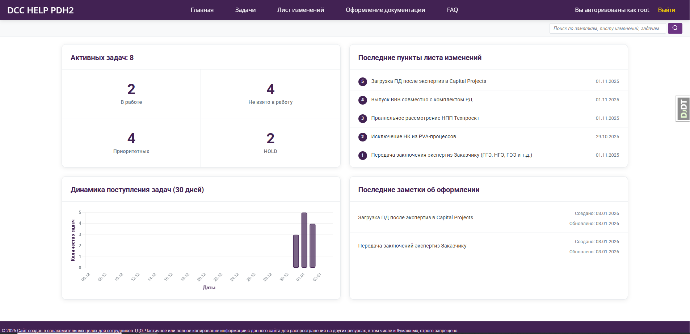
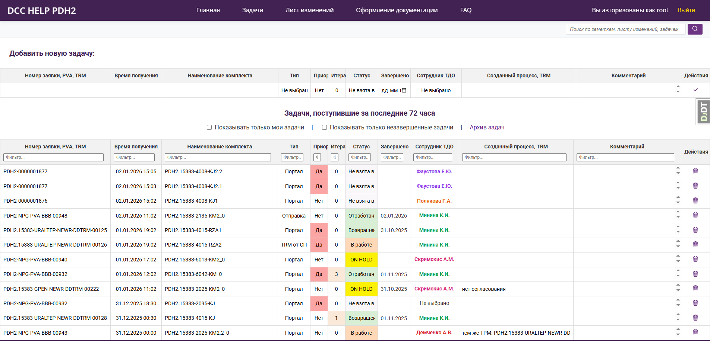
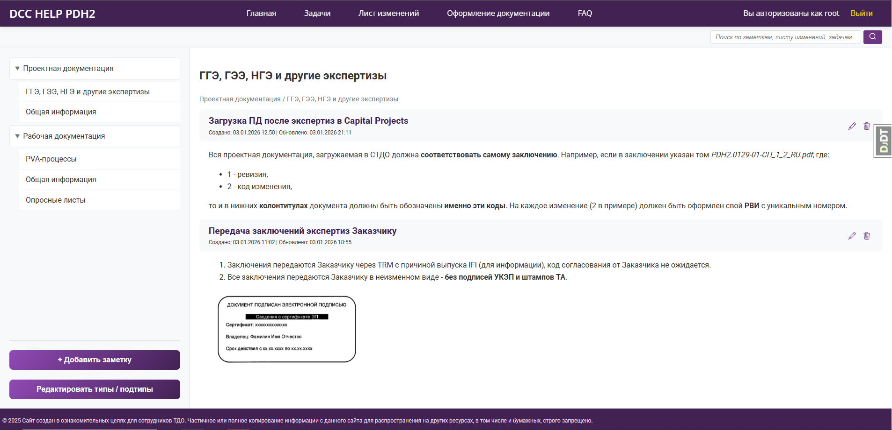
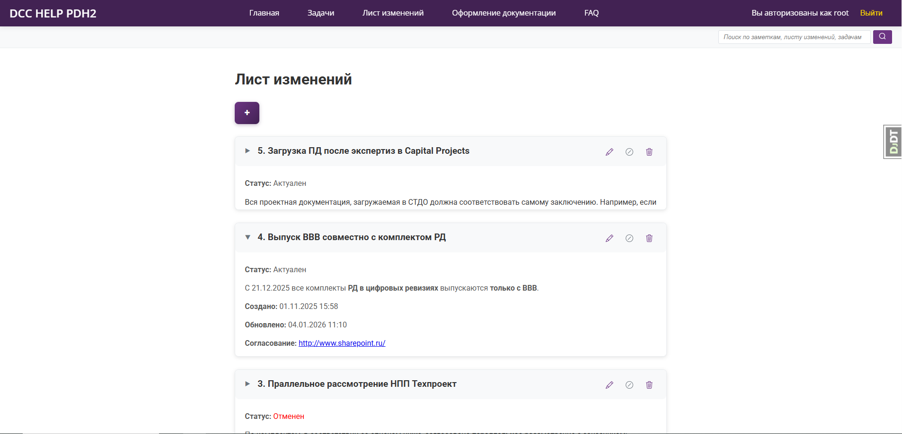

# DCCHELP 🚀

**Единый помощник для управления задачами и документацией в техническом документообороте**

DCCHELP — это внутренняя веб-платформа для отдела технического документооборота (ТДО), созданная для централизации рабочих процессов, отслеживания задач и хранения нормативной информации. Система объединяет инструменты ежедневной работы сотрудников на единой интуитивно понятной панели.

[](https://www.python.org/)
[](https://www.djangoproject.com/)
[](https://www.postgresql.org/)
[](https://getbootstrap.com/)
[](https://github.com/meeewwwww/dcchelp)

---

## ✨ Ключевые возможности

*   **📊 Интерактивные дашборды:** Наглядное отображение текущей нагрузки (задачи в работе, на удержании, приоритетные), динамика поступления задач за 30 дней, быстрые ссылки на последние изменения.
*   **🗂️ Управление задачами:** Полный цикл работы с задачами от поступления до архива. Фильтрация, поиск и экспорт данных в Excel.
*   **📚 База знаний по оформлению:** Структурированный раздел с заметками и скриншотами по правилам оформления проектной документации. Интегрированный полнотекстовый поиск.
*   **📃 Лист изменений:** Централизованное место для публикации важных решений, согласований и обновлений по проекту.
*   **🔍 Универсальный поиск:** Мгновенный поиск по всем разделам платформы: задачам, заметкам и записям листа изменений.
*   **🔐 Безопасный доступ:** Полная закрытость платформы. Просмотр контента возможен только после авторизации.

---

## 🖼️ Скриншоты

| **Главная страница** | **Раздел с задачами** |
| :---: | :---: |
|  |  |
| *Обзор статистики и последних активностей* | *Управление и фильтрация текущих задач* |

| **База знаний (Оформление документации)** | **Лист изменений** |
| :---: | :---: |
|  |  |
| *Правила оформления со скриншотами* | *Важные решения и согласования* |

---

## 🚀 Быстрый старт

Следуйте этим инструкциям, чтобы развернуть проект локально для разработки и тестирования.

### Предварительные требования

*   Python 3.9 или выше
*   PostgreSQL (версия 13 или выше)
*   Pip (менеджер пакетов Python)

### Установка

1.  **Клонируйте репозиторий:**
    ```bash
    git clone https://github.com/meeewwwww/dcchelp.git
    cd dcchelp
    ```

2.  **Создайте и активируйте виртуальное окружение (рекомендуется):**
    ```bash
    python -m venv venv
    # Для Windows:
    venv\Scripts\activate
    # Для Linux/macOS:
    source venv/bin/activate
    ```

3.  **Установите зависимости:**
    ```bash
    pip install -r requirements.txt
    ```

4.  **Настройте базу данных:**
    *   Создайте базу данных в PostgreSQL.
    *   Создайте файл `.env` в корне проекта на основе примера `.env.example` и укажите свои параметры:
        ```env
        DEBUG=True
        SECRET_KEY=your-secret-django-key-here
        DB_NAME=your_db_name
        DB_USER=your_db_user
        DB_PASSWORD=your_db_password
        DB_HOST=localhost
        DB_PORT=5432
        ```

5.  **Примените миграции:**
    ```bash
    python manage.py migrate
    ```

6.  **Создайте суперпользователя (администратора):**
    ```bash
    python manage.py createsuperuser
    ```
    Следуйте инструкциям в терминале, чтобы задать логин, email и пароль.

7.  **Запустите сервер для разработки:**
    ```bash
    python manage.py runserver
    ```

8.  **Откройте браузер и перейдите по адресу:** [http://127.0.0.1:8000](http://127.0.0.1:8000)
    *   Для доступа к админ-панели Django перейдите по адресу: [http://127.0.0.1:8000/admin](http://127.0.0.1:8000/admin)

---

## 🏗️ Архитектура и стек технологий

Проект построен на основе классической архитектуры Django (MVT - Model-View-Template).

*   **Бэкенд:** Python, Django
*   **Фронтенд:** HTML, CSS (Bootstrap 5), JavaScript (Vanilla JS / небольшие скрипты)
*   **База данных:** PostgreSQL
*   **Аутентификация:** Стандартная система аутентификации Django

---

## 📈 Статус проекта и планы

Проект находится на стадии **альфа-тестирования (Alpha)**.

✅ **Что работает стабильно:**
*   Все основные функции (дашборды, управление задачами, база знаний, лист изменений, поиск).
*   Авторизация и разграничение доступа.
*   Экспорт данных в Excel.

🔄 **В ближайших планах:**
1.  **Рефакторинг кода:** Улучшение структуры проекта, удаление дублирующего кода, следование лучшим практикам (PEP 8, DRY, SOLID).
2.  **Внедрение Docker:** Контейнеризация приложения для упрощения развертывания.
3.  **Улучшение интерфейса:** Переработка некоторых страниц для повышения удобства пользования.
4.  **Письменная документация:** Создание подробного руководства пользователя и технической документации.

---

## 👨‍💻 Контакты и вклад в проект

Это мой первый полноценный проект на Django, созданный с целью систематизации рабочих процессов и как портфолио для переквалификации в IT-сферу.

*   **Автор:** Анна Демченко
*   **Telegram для связи:** [@meeewwwwww](https://t.me/meeewwwwww)

Если у вас есть предложения по улучшению или вы нашли баг — буду рада обратной связи в Telegram. Пулл-реквесты на данном этапе, к сожалению, не рассматриваются, так как проект готовится к масштабному рефакторингу.

---

## 📄 Лицензия

На данный момент проект не имеет явной лицензии. Все права сохраняются за автором. При использовании кода или идей, пожалуйста, свяжитесь со мной.
